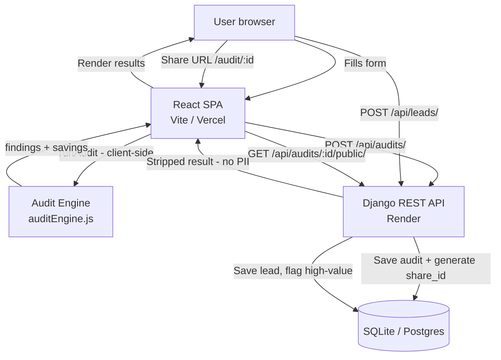

# Architecture

## System diagram

## Data flow: form input → audit result

1. User enables tools and fills plan/seats/spend on the form page.
2. Form state is persisted to `localStorage` on every change.
3. On submit, `runAudit(formData)` runs entirely client-side — no round trip needed for the math. This makes the audit instant and works offline.
4. For each enabled tool, the engine runs tool-specific rule functions that check plan/seat/use-case combinations against known pricing. Each rule returns `{ action, saving, reason }`.
5. Total monthly and annual savings are summed. A flag is set if savings > $500/mo (triggers Credex CTA).
6. A templated summary paragraph is generated from the findings.
7. The full `formData` and `result` are POSTed to Django, which saves them and returns a `share_id`.
8. The browser URL updates to `/audit/:shareId` without a page reload.
9. When a share URL is visited, the frontend fetches `/api/audits/:id/public/` which returns the result with PII stripped.

## Stack choices

| Layer | Choice | Why |
|---|---|---|
| Frontend | React + Vite | Fast DX, simple SPA, no SSR needed |
| Styling | Plain CSS + CSS variables | No build step for styles, full control, Lighthouse-friendly |
| Backend | Django + DRF | Familiar Python, batteries-included ORM, fast to scaffold |
| DB | SQLite → Postgres | Zero config locally, one env var to swap in prod |
| Deploy frontend | Vercel | Git-push deploy, free tier, edge CDN |
| Deploy backend | Render | Free tier Postgres, env var management |
| CI | GitHub Actions | Native, free, integrates with branch protection |

## What changes at 10k audits/day

- **Move to Postgres** (already abstracted in Django ORM — one env var change).
- **Add Redis + django-ratelimit** for distributed rate limiting (current SQLite-backed DRF throttle won't scale across workers).
- **Offload lead email sending to a queue** (Celery + Redis or Render Background Workers) so the API response isn't blocked on SMTP.
- **Cache public audit results** in Redis with a short TTL — most share link traffic hits the same few audit IDs.
- **Add a CDN layer** for the Vite static build (Vercel already handles this).
- **Index `share_id` and `email`** in Postgres for fast lookups (already done in the model).
