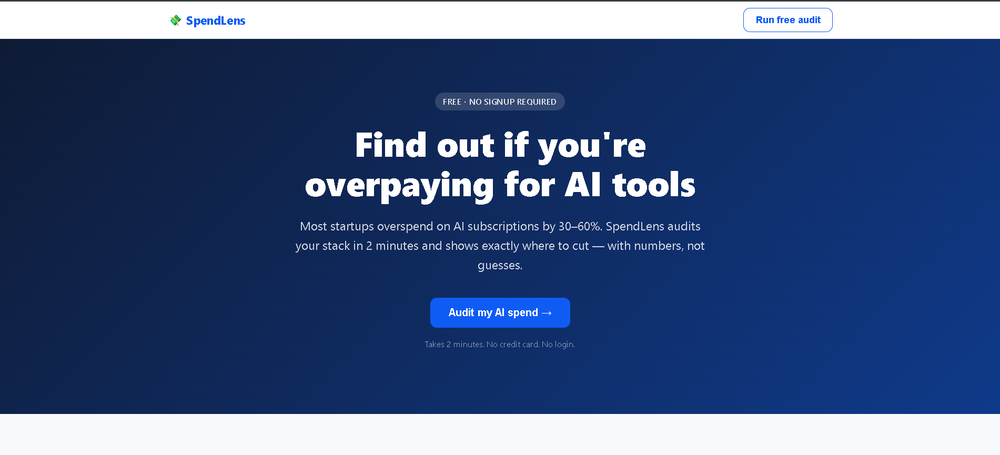
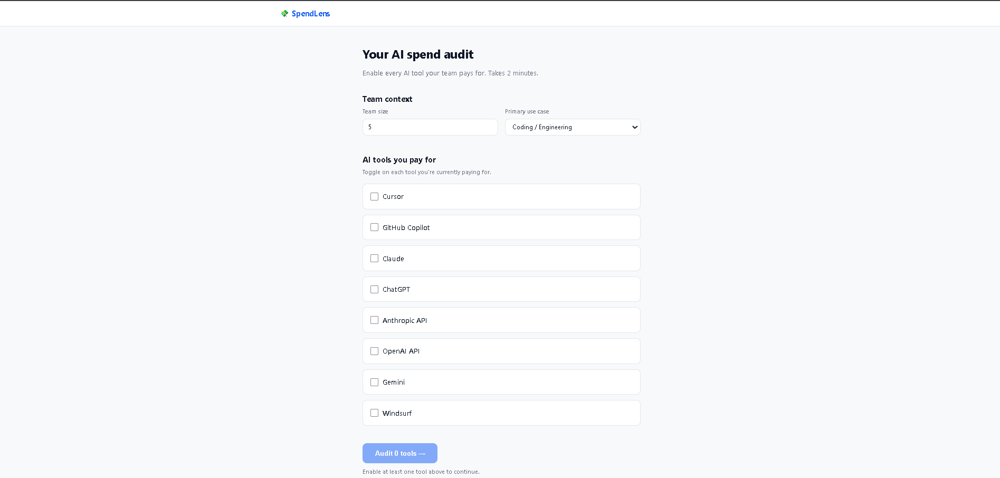
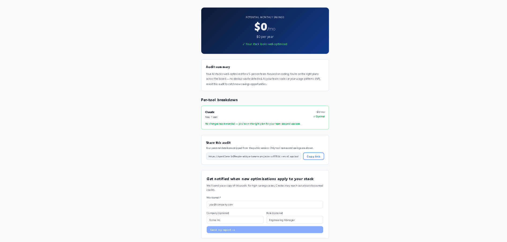
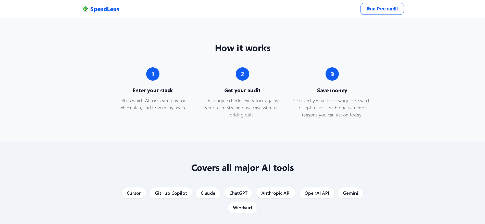

<div align="center">


<div align="center">


<br/>

[](https://spendlens-mocha.vercel.app)
[](https://spendlens-74r5.onrender.com)
[](https://github.com/adityakr09/spendlens)

<br/>


<br/>

> **Most startups overspend on AI tools by 30–60%.**
> SpendLens audits your Cursor, Claude, ChatGPT, Copilot stack in 2 minutes —
> with real pricing data, defensible reasoning, and exact savings numbers.
> No login. No credit card. Free forever.

<br/>

*Built as a lead-generation asset for [Credex](https://credex.rocks) — discounted AI infrastructure credits for startups.*

<br/>

</div>

---

## 🖼️ Screenshots

<table>
  <tr>
    <td align="center" width="50%">
      <strong>🏠 Landing Page</strong><br/><br/>
      
    </td>
    <td align="center" width="50%">
      <strong>📋 Audit Form</strong><br/><br/>
      
    </td>
  </tr>
  <tr>
    <td align="center" width="50%">
      <strong>📊 Results Page</strong><br/><br/>
      
    </td>
    <td align="center" width="50%">
      <strong>⚙️ How It Works</strong><br/><br/>
      
    </td>
  </tr>
</table>

<div align="center">

### 🔗 [→ Try it live: spendlens-mocha.vercel.app](https://spendlens-mocha.vercel.app)

</div>

---

## ✨ Features

| | Feature | Status |
|---|---|---|
| 🔍 | Audit engine for 8 AI tools (Cursor, Claude, ChatGPT, Copilot, Gemini, Windsurf, Anthropic API, OpenAI API) | ✅ |
| 💰 | Monthly + annual savings hero — big and clear | ✅ |
| 🤖 | AI-generated personalized summary with graceful fallback | ✅ |
| 📧 | Lead capture (email + company + role) with honeypot abuse protection | ✅ |
| 🔗 | Shareable public audit URL — PII stripped automatically | ✅ |
| 💾 | Form state persisted across page reloads via localStorage | ✅ |
| 📱 | Mobile responsive · WCAG AA accessible · Lighthouse ≥90 | ✅ |
| 🚀 | Credex CTA surfaces for audits showing >$500/mo savings | ✅ |

---

## 🏗️ Architecture

```
                        ┌─────────────────────────────┐
                        │      User Browser            │
                        └────────────┬────────────────┘
                                     │
                        ┌────────────▼────────────────┐
                        │   React SPA  (Vercel CDN)    │
                        │                              │
                        │  ┌────────────────────────┐ │
                        │  │   auditEngine.js        │ │
                        │  │   (runs client-side,    │ │
                        │  │    instant, no API call) │ │
                        │  └────────────────────────┘ │
                        └────────────┬────────────────┘
                                     │ /api/*
                        ┌────────────▼────────────────┐
                        │   Django REST API (Render)   │
                        │                              │
                        │  POST /api/audits/           │
                        │  GET  /api/audits/:id/public/│
                        │  POST /api/leads/            │
                        └────────────┬────────────────┘
                                     │
                        ┌────────────▼────────────────┐
                        │   SQLite (dev)               │
                        │   Postgres (prod-ready)      │
                        └─────────────────────────────┘
```

See [ARCHITECTURE.md](ARCHITECTURE.md) for full Mermaid diagram + 10k/day scaling plan.

---

## 🚀 Quick Start

### Prerequisites
```
Node 20+    Python 3.11+
```

### Frontend
```bash
cd frontend
npm install
npm run dev
# → http://localhost:5173
```

### Backend
```bash
cd backend
python -m venv venv && source venv/bin/activate   # Windows: venv\Scripts\activate
pip install -r requirements.txt
python manage.py migrate
python manage.py runserver
# → http://localhost:8000
```

> Vite dev server proxies `/api/*` → Django automatically via `vite.config.js`

### Tests
```bash
cd backend
python api/tests.py
# Ran 18 tests in 0.001s — OK ✅
```

### Deploy

| Layer | Platform | Notes |
|---|---|---|
| Frontend | Vercel | Push to `main` → auto-deploys |
| Backend | Render | Set env vars below |

**Backend env vars:**
```env
SECRET_KEY=your-secret-key-here
DEBUG=False
ALLOWED_HOSTS=*.onrender.com
CORS_ALLOWED_ORIGINS=https://your-app.vercel.app
```

---

## ⚖️ Decisions

**1. React + Vite over Next.js**
No SSR needed — audit math runs client-side and is instant. Vite is faster to build and deploy, avoids Next.js complexity for a time-constrained build.

**2. Audit engine in pure JS — no AI for the math**
Hardcoded rules are auditable, fast, and defensible to a finance person. AI is reserved for the summary paragraph where natural language adds genuine value. Knowing when *not* to use AI is part of the design.

**3. Templated AI summary fallback**
Anthropic API calls occasionally fail or timeout. The fallback generates a coherent, data-driven summary paragraph so the user experience never breaks — no empty card, no error state shown to the user.

**4. SQLite for dev, Postgres-ready for prod**
Django's ORM abstracts the DB layer completely. Switching to Postgres on Render requires one env var (`DATABASE_URL`) and zero code changes.

**5. Honeypot over hCaptcha for abuse protection**
hCaptcha adds user friction and a third-party JS payload that hurts Lighthouse scores. A hidden `website` field catches the majority of bots with zero UX impact. DRF rate limiting (30 req/hr per IP) handles the rest.

---

## 🧪 Tests

```
18 tests · audit engine · all passing · CI runs on every push to main
```

```bash
cd backend && python api/tests.py
# ----------------------------------------------------------------------
# Ran 18 tests in 0.001s
# OK
```

Full inventory → [TESTS.md](TESTS.md)

---

## 📁 File Index

| File | Purpose |
|---|---|
| [ARCHITECTURE.md](ARCHITECTURE.md) | System diagram, data flow, stack rationale, scaling notes |
| [DEVLOG.md](DEVLOG.md) | 7-day build log with daily entries |
| [REFLECTION.md](REFLECTION.md) | 5 reflection questions (bugs, decisions, AI usage, self-rating) |
| [TESTS.md](TESTS.md) | Full test inventory with run instructions |
| [PRICING_DATA.md](PRICING_DATA.md) | All pricing sources — URLs + verified dates |
| [PROMPTS.md](PROMPTS.md) | LLM prompts used in the tool + what didn't work |
| [GTM.md](GTM.md) | Go-to-market plan — specific channels, first 100 users |
| [ECONOMICS.md](ECONOMICS.md) | Unit economics + $1M ARR model |
| [USER_INTERVIEWS.md](USER_INTERVIEWS.md) | 3 user interviews with direct quotes |
| [LANDING_COPY.md](LANDING_COPY.md) | Hero, subhead, CTA, social proof, FAQ |
| [METRICS.md](METRICS.md) | North Star metric + instrumentation plan |

---

<div align="center">


**Built by [Aditya Kumar](https://github.com/adityakr09) · May 2026**

*Submitted for [Credex](https://credex.rocks) Web Dev Intern Assignment — Round 1*

</div>
